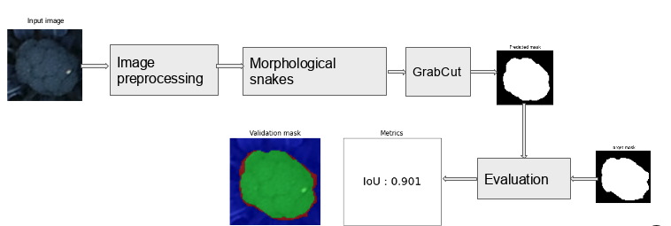
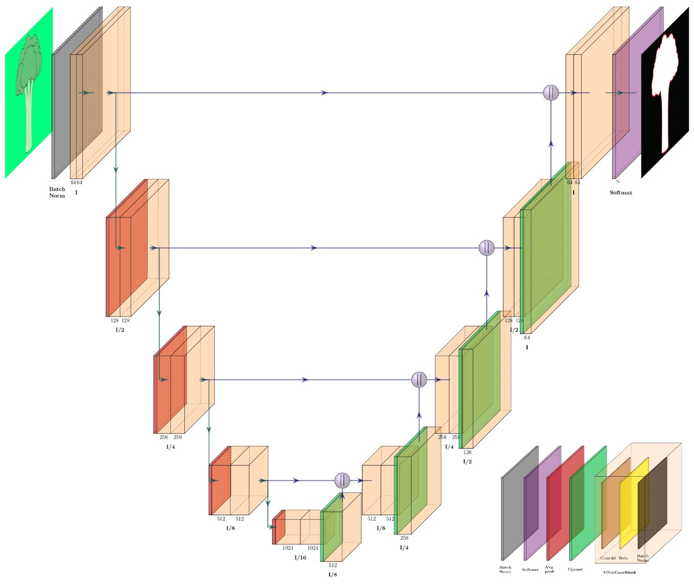
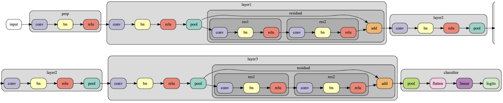
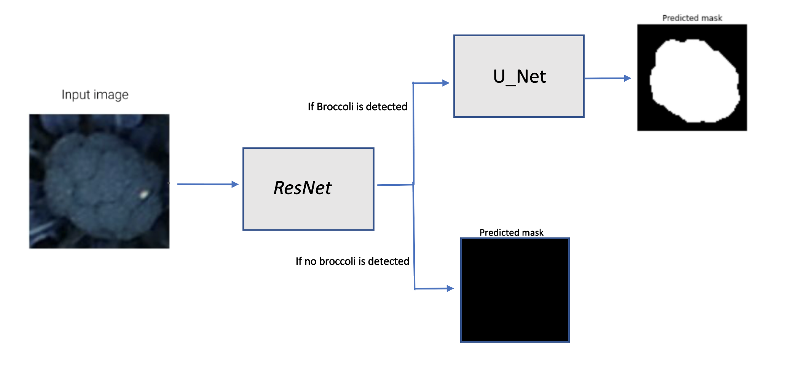

# Broccoli head segmentation and classification

This repository containes two different approaches to determine the shape and size of a given broccoli head image given as input:
- Unsupervised Approach
- Supervised Approach

# Setup
## Create Conda environment
`conda env create -f conf/environment.yml`

# Unsupervised Approach
This approach generates segmentation masks for broccoli heads in an unsupervised fashion.  Two different segmentation algorithms are implemented:
- Morphological snakes (ACWE): https://scikit-image.org/docs/dev/api/skimage.segmentation.html#skimage.segmentation.chan_vese
- GrabCut : https://docs.opencv.org/master/d7/d1b/group__imgproc__misc.html#ga909c1dda50efcbeaa3ce126be862b37f

## Dataset
The ground truth masks format supported by this implementation is a JSON file containing a polygon of points describing the shape of broccoli heads. An examples of dataset can be found at `IRONMAN/Development/200 training data/Segmentation individual_head_segmentation/unsupervised`.
## Usage
Run unsupervised/scripts/create_masks.py to create segmented masks given broccoli heads images as input. 
The script's arguments are:
```bash
usage: python unsupervised/scripts/create_masks.py --dataset_path PATH_IMAGES --save_masks_path SAVE_PATH
```
Run python unsupervised/scripts/evaluate_masks.py to evaluate the predicted segmented masks given broccoli heads images and the ground truth masks as input. 
The script's arguments are:
```bash
usage: python unsupervised/scripts/evaluate_masks.py --dataset_path PATH_IMAGES --number_masks_visualize NUMBER_MASKS
```

# Supervised Approach

# Segmentation
This approach generates segmentation masks for broccoli heads in a supervised fashion. A U-net model is impleneted for image segmentation.<br /><br />

## Usage
Run  supervised/segmentation/scripts/training.py to train a new UNET for broccoli heads segmentation. 
The script's arguments are:
```bash
usage: python supervised/segmentation/scripts/training.py --dataset_images_path PATH_IMAGES --dataset_masks_path PATH_MASKS --save_model_path PATH_SAVE_MODEL
```
Run supervised/segmentation/scripts/create_masks.py to create segmented masks given broccoli heads images as input. 
The script's arguments are:
```bash
usage: python supervised/segmentation/scripts/create_masks.py --dataset_images_path PATH_IMAGES --model_path PATH_MODEL --save_masks_path SAVE_PATH
```
Run supervised/segmentation/scripts/evaluate_masks.py to evaluate the predicted segmented masks given broccoli heads images and the ground truth masks as input. 
The script's arguments are:
```bash
usage: python supervised/segmentation/scripts/evaluate.py --dataset_images_path PATH_IMAGES --dataset_masks_path PATH_MASKS --model_path PATH_MODEL --number_masks_visualize NUMBER_MASKS
```
# Binary Classification
This approach includes a binary classifier model, given an image, it detects the presence of a broccoli in the image.<br /><br />

## Usage
Run  supervised/binary_classification/scripts/training.py to train a new small ResNet for binary broccoli classification.
The script's arguments are:
```bash
usage: supervised/binary_classification/scripts/training.py --dataset_images_path PATH_IMAGES --save_model_path PATH_SAVE_MODEL
```
Run supervised/binary_classification/scripts/evaluate.py to evaluate the binary classification model.
The script's arguments are:
```bash
usage: supervised/binary_classification/scripts/evaluate.py --dataset_images_path PATH_IMAGES --model_path PATH_MODEL
```

# Wrapper Model
This approach implements a wrapper model, which includes a binary classification and segmentation pipeline.<br /><br />

## Usage
Run  supervised/wrapper/scripts/tile_pipeline.py to segement a tile of broccoli.
The script's arguments are:
```bash
usage: supervised/wrapper/scripts/tile_pipeline.py --dataset_images_path PATH_IMAGES --annotations_broccoli_path PATH_ANNOTATION --classification_model_path PATH_CLASSIFIER --segmentation_model_path PATH_SEGMENTATION_MODEL --save_masks_path PATH_OUTPUT
```
Run supervised/wrapper/scripts/evaluate.py to evaluate the predicted segmented masks given broccoli heads images and the ground truth masks as input. 
The script's arguments are:
```bash
usage: supervised/wrapper/scripts/evaluate.py --dataset_images_path PATH_IMAGES --dataset_masks_path PATH_MASKS --classification_model_path PATH_CLASSIFIER --segmentation_model_path PATH_SEGMENTATION_MODEL
```
